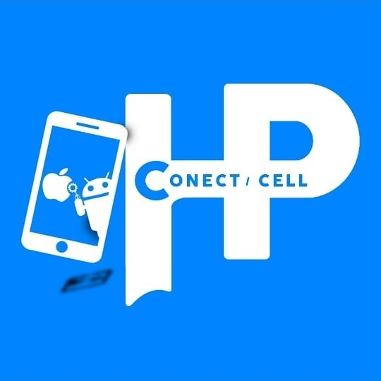

# Página Pessoal do PQPMath3ws

Olá, meu caro jovem gafanhoto!

Se você ainda não me conhece, satisfação! - Me chamo Mathews Martins, tenho 24 anos, sou um cidadão brasileiro, mineirinho raíz e meu nick artístico é [**PQPMath3ws**](https://pqpmath3ws.github.io/).

Criei essa página aqui no GitHub Pages para poder compartilhar um pouco dos conhecimentos que eu adquiri com o tempo, em alguns diversos nichos e servir como um portfólio das minhas habilidades como <code>Full Stack Developer</code>, <code>Hacker Ético</code> e <code>Produtor Musical</code>.

Minha página pessoal está separada em 4 nichos:

- [**Hacker Sincero**](https://pqpmath3ws.github.io/hacker-sincero/), onde falo sobre <code>cybersegurança / segurança da informação / segurança digital</code> de forma simples e didática, para um usuário comum entender como funciona melhor a internet e como se manter mais seguro.
- [**Produtor Otimista**](https://pqpmath3ws.github.io/produtor-otimista/), onde relato um pouco mais sobre produção músical, de forma totalmente digital *(in the box)*, e como realizar-la.
- [**Programador Louco**](https://pqpmath3ws.github.io/programador-louco/), onde passo a visão de estratégias, ideias, e dicas de como se tornar um bom developer, na minha opinião *(e dou um pitaco também sobre tecnologias / linguagens disponíveis no mercado)*
- [**Página do Artista**](https://pqpmath3ws.github.io/extras/), onde contém todas as músicas produzidas e publicadas por mim, até o exato momento, e outras coisas a mais sobre mim.

Eu espero realmente conseguir compartilhar um pouco do meu conhecimento a você, jovem internauta, e poder ajudar de alguma forma com o que eu compartilhar.

# Patrocinadores

  <a href="https://www.instagram.com/conect_hpcell/">
    </img>
  </a>

